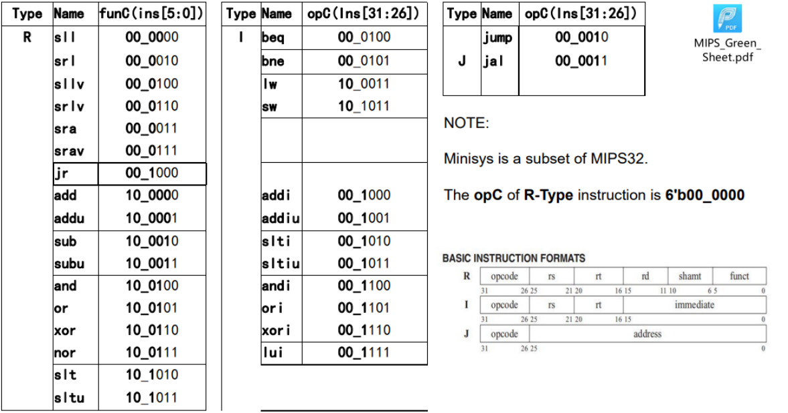
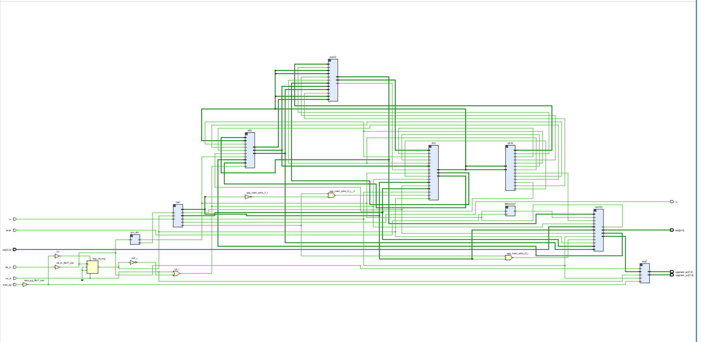

# CS214 CPU Report


## 开发者(developers)

@MQ_Adventure 开发部分: 子模块（decoder and controller), 测试场景1, 2 的测试汇编, Report 

@Cobalt-27 开发部分: 子模块 (ALU) 以及顶层模块（CPU_Top) , syscall部分

@aeroplanepaper 开发部分: 子模块（data memory and ifetch)，Uart接口，syscall，七段数码管

## CPU 结构

### CPU 特性

#### ISA

实现了Minisys指令集，Minisys 指令集是MIPS32指令集的子集



除此之外，我们还额外扩展了syscall 指令

#### 寻址空间

本小组的 CPU 属于哈佛结构，即指令内存与数据内存分开存储。

外设IO寻址空间：

- led 灯：0b10xx_xxxx_xxxx_xxxx_xxxx_xxxx_xxxx_xxxx
- 七段数码管：11xx_xxxx_xxxx_xxxx_xxxx_xxxx_xxxx_xxxx
- Instruction: [15:2]，第15位保持0，代表instruction
- Mem: 0x1001_0000-0x1004_0000

#### CPU 描述

本小组的 CPU 属于单周期的CPU，不支持 pipeline，CPU 频率为23MHz，CPI 为1

### CPU 接口

本小组的 CPU 拥有一个复位按钮，读取输入信息的回车开关，以及时钟信号接口以及 uart 接口

### CPU 内部结构

####  内部子模块接口连接图



#### 子模块设计说明

**Decoder**

- 模块功能：通过输入的指令信号以及来自 controller 对应的信号以及 复位，时钟信号，重置或者读出对应寄存器的数据 (扩展后的32位立即数，以及两个寄存器里面的操作数)

- 端口规格以及功能

  ```verilog
   	input[31:0]  Instruction;               // 取指单元来的指令
      input[31:0]  mem_data;   				// 从DATA RAM or I/O port取出的数据
      input[31:0]  ALU_result;   				// 从执行单元来的运算的结果
      input        Jal;                       // 来自控制单元，说明是JAL指令 
      input        RegWrite;                  // 来自控制单元
      input        MemtoReg;                  // 来自控制单元
      input        RegDst;             
      input		 clock,reset;               // 时钟和复位
      input[31:0]  opcplus4;                  // 来自取指单元，JAL中用
      
      output[31:0] Sign_extend;               // 扩展后的32位立即数
      output[31:0] read_data_1;               // 输出的第一操作数  
      output[31:0] read_data_2;               // 输出的第二操作数 
  ```

**Controller**

- 模块功能：通过输入的指令对应字段，输出与指令类型符合的控制信号(RegDst, RegWrite, ALUSrc, PCSrc, MemRead, MemWrite, MemtoReg)
- 端口规格以及功能

```verilog
input[5:0]   Opcode;            // 来自IFetch模块的指令高6bit，instruction[31..26]
    input[5:0]   Function_opcode;  	// 来自IFetch模块的指令低6bit，用于区分r-类型中的指令，instructions[5..0]
    output       Jr;         	 // 为1表明当前指令是jr，为0表示当前指令不是jr
    output       RegDST;          // 为1表明目的寄存器是rd，否则目的寄存器是rt
    output       ALUSrc;          // 为1表明第二个操作数（ALU中的Binput）是立即数（beq，bne除外），为0时表示第二个操作数来自寄存器
    output       MemtoReg;     // 为1表明需要从存储器或I/O读数据到寄存器
    output       RegWrite;   	  //  为1表明该指令需要写寄存器
    output       MemWrite;       //  为1表明该指令需要写存储器
    output       Branch;        //  为1表明是beq指令，为0时表示不是beq指令
    output       nBranch;       //  为1表明是Bne指令，为0时表示不是bne指令
    output       Jmp;            //  为1表明是J指令，为0时表示不是J指令
    output       Jal;            //  为1表明是Jal指令，为0时表示不是Jal指令
    output       I_format;      //  为1表明该指令是除beq，bne，LW，SW之外的其他I-类型指令
    output       Sftmd;         //  为1表明是移位指令，为0表明不是移位指令
    output[1:0]  ALUOp;        //  是R-类型或I_format=1时位1（高bit位）为1, beq、bne指令则位0（低bit位）为1
```

**Dmemory**

- 模块功能：通过传入的信号，输入的内存地址以及需要写入的数据控制内存数据的写入以及读出，并且同步映射到 LED 灯进行显示
- 端口规格以及功能

```verilog
	input clock, memWrite;  //memWrite 来自controller，为1'b1时表示要对data-memory做写操作
    input [31:0] address;   //address 以字节为单位
    input [31:0] writeData; //writeData ：向data-memory中写入的数据
	input [23:0] switch_in;  //switch_in ：开关输入
    output reg[31:0] readData;  //writeData ：从data-memory中读出的数据
    output reg[23:0] led_out; // 控制 LED 灯相关信号
```

**Ifetch**

- 模块功能: 通过输入的地址数据以及确定读取指令内存信息的信号来从指令内存获取相应的指令
- 端口规格以及功能

```verilog
	input[31:0]  Addr_result;           // 来自ALU,为ALU计算出的跳转地址
    input[31:0]  Read_data_1;           // 来自Decoder，jr指令用的地址
    input        Branch;                // 来自控制单元
    input        nBranch;               // 来自控制单元
    input        Jmp;                   // 来自控制单元
    input        Jal;                   // 来自控制单元
    input        Jr;                    // 来自控制单元
    input        Zero;                  //来自ALU，Zero为1表示两个值相等，反之表示不相等
    input        clock,reset;           //时钟与复位,复位信号用于给PC赋初始值，复位信号高电平有效

    output[31:0] Instruction;			// 根据PC的值从存放指令的prgrom中取出的指令
    output[31:0] branch_base_addr;      // 对于有条件跳转类的指令而言，该值为(pc+4)送往ALU
output reg[31:0] link_addr;             // JAL指令专用的PC+4
```

**ALU**

- 模块功能：利用输入的数据信息以及对应的运算信号来进行数据之间的运算，运算完毕后设置对应的信号以及结果的数据信息
- 端口规格以及功能

```verilog
	input[31:0]  Read_data_1;		// 从译码单元的Read_data_1中来
    input[31:0]  Read_data_2;		// 从译码单元的Read_data_2中来
    input[31:0]  Sign_extend;		// 从译码单元来的扩展后的立即数
    input[5:0]   Function_opcode;  	// 取指单元来的r-类型指令功能码,r-form instructions[5:0]
    input[5:0]   Exe_opcode;  		// 取指单元来的操作码
    input[1:0]   ALUOp;             // 来自控制单元的运算指令控制编码
    input[4:0]   Shamt;             // 来自取指单元的instruction[10:6]，指定移位次数
    input  		 Sftmd;            // 来自控制单元的，表明是移位指令
    input        ALUSrc;            // 来自控制单元，表明第二个操作数是立即数（beq，bne除外）
    input        I_format;          // 来自控制单元，表明是除beq, bne, LW, SW之外的I-类型指令
    input        Jr;               // 来自控制单元，表明是JR指令
    output       Zero;              // 为1表明计算值为0 
    output reg[31:0] ALU_Result;        // 计算的数据结果
    output[31:0] Addr_Result;		// 计算的地址结果        
    input[31:0]  PC_plus_4;         // 来自取指单元的PC+4
```

**CPU top**

```verilog
module cputop(
    input rst_in, // 重置信号
    input enter, // 回车键控制
    input wire[23:0] sw, // 拨码开关输入
    input wire clk_in, // 时钟信号输入
    output wire[23:0] led, // led 灯输出
    //uart pinpoints
    input start_pg,
    input rx,
    output tx,

    output[7:0] segment_en, // 七段数码管使能输出 
    output[7:0] segment_out // 七段数码管显示
    );
```

**Debounce防抖模块**

```verilog
module debounce(
    input wire clk,// 时钟信号
    input wire key_in, // 信号
    output reg key_out
);
```

**七段数码管**

```verilog
module seg7(
    input rst_n,
    input clk,
    input [31:0] data,
    input uart_start,
    input uart_done,
    output reg [7:0] segment_en,
    output reg[7:0] segment_out
    );
```

**Uart**

```verilog
module Uart(
        input upg_clk_o,
        input upg_rst,
        input rx, // 接受来自UART的数据
        input upg_clk_w,
        input upg_wen_w,
    	input upg_adr_w,
       	input upg_dat_w,
        output upg_done_w,
        output tx//接受完毕后向电脑传输一个信号，告知用户传输完毕。
    );
```


## 测试说明

测试方法：仿真 + 上板测试

测试类型：集成

#### 测试用例1

| 场景1.用例编号 | 用例描述                                                     | 测试结果 |
| -------------- | ------------------------------------------------------------ | -------- |
| 3‘b000         | 输入测试数a，输入完毕后在led灯上显示a，同时用1个led灯显示a是否为二进制回文的判定（根据a 的实际位宽来做判断，比如4’b1001是回文，该led灯亮，否则该led灯不亮） | 通过     |
| 3'b001         | 输入测试数a，输入完毕后在输出设备上显示a；输入测试数b；输入完毕后在输出设备上显示b | 通过     |
| 3'b010         | 计算 a & b，将结果显示在输出设备                             | 通过     |
| 3'b011         | 计算 a \| b，将结果显示在输出设备                            | 通过     |
| 3'b100         | 计算 a ^ b，将结果显示在输出设备                             | 通过     |
| 3'b101         | 计算 a 逻辑左移 b位，将结果显示在输出设备                    | 通过     |
| 3'b110         | 计算 a 逻辑右移 b位，将结果显示在输出设备（测试时会考虑先做左移后再右移） | 通过     |
| 3'b111         | 计算 a 算数右移 b位，将结果显示在输出设备（测试时会考虑先做左移后再右移） | 通过     |

#### 测试用例2

| 数据集编号       | 数据集0          | 数据集1                                                | 数据集2                                                      | 数据集3                                                      |
| ---------------- | ---------------- | ------------------------------------------------------ | ------------------------------------------------------------ | ------------------------------------------------------------ |
| 数据集的起始地址 | base + 0         | base + 1*space                                         | base + 2*space                                               | base + 3*space                                               |
| 数据说明         | 输入数据原样保存 | 将输入数据视为无符号数，按从小到大排序后顺序存放的数据 | 将输入数据视为按照下标中的3’b010对应行的方式做识别，转换成补码后进行存放，存放次序与数据集0中的输入数据一致 | 基于“数据集2”中的数据，视其为有符号数的 补码，按从小到大排序后顺序存放的数据 |

| 测试用例编号 | 测试描述                                                     | 测试结果 |
| ------------ | ------------------------------------------------------------ | -------- |
| 3’b000       | 输入测试数据的个数（小于或等于10），以2进制的方式输入多个测试数据，将测试数据原样存入上表 ”数据集0“对应的空间 | 通过     |
| 3'b001       | 将测试数据视为无符号数（bit7与bit6~bit0一样，都被视为数值位的一部分），将数据按照从小到大的方式进行排序，排序后的数据集合作 为一个整体存入上表 ”数据集1“ 对应的空间中（数值最小的存放在低地址，依次类推，数值最大的存放在高地址） | 通过     |
| 3;b010       | 将测试数据（此时”数据集0“中的每一个数据，其bit6~bit0被视为该数值的绝对值，bit7对应该数值的符号位）转换为有符号数的补码形式， 将做完转换后的数据集存入上表 ”数据集2“ 对应的空间中（存放次序与数据集0中的数据一致 | 通过     |
| 3’b011       | 基于“数据集2”中的数据，视其为有符号数的补码，按从小到大排序后顺序存放的数据，排序后的数据集合作为一个整体存入上表 ”数据集 3“ 对应的空间中（数值最小的存放在低地址，依次类推，数值最大的存放在高地址） | 通过     |
| 3'b100       | 输入数据集编号（1或3），用该数据集的最大值减去其中的最小值，将结果做输出 | 通过     |
| 3'b101       | 输入数据集编号（1或3），用该数据集的最大值减去其中的最小值，将结果做输出 | 通过     |
| 3’b110       | 输入数据集编号（1或2或3）和该数据集中元素的下标(从0开始编址)，将该数组元素转为IEEE745单精度浮点形式， 输出IEEE745单精度形式中的符号位（1位）和指数位（8位) | 通过     |
| 3’b111       | 输入元素的下标(从0开始编址)，交替显示两组数据（每隔5秒交替一次） 1）1‘b0，数据集0中该下标对应数据的二进制形式（8bit位宽） 2）1’b1, 该数据的IEEE745单精度浮点形式编码（含符号位（1位）和指数位（8位）) | 通过     |

#### 测试结论

 CPU 可以正常按照测试用例进行运算以及显示，可以完成正常 CPU 具有的功能。

## Bonus 说明

#### 扩展指令集 

在本 CPU 当中，我们实现了 syscall ，且我们的 syscall 可以比较全面地支持实际 syscall 使用中的大部分功能，具体功能如下所示：

- 显示数字
- 读入数字
- 系统休眠一秒
- 系统休眠指定任意秒数
- 单独控制七段数码管的显示
- 程序退出

并且全部的 syscall 功能是通过软件而不是硬件实现，符合现实操作系统中syscall的实现方式。

#### 优化用户交互体验

在 CPU 当中，我们小组实现了回车键的功能，在用户通过拨码开关输入了数字之后，可以通过回车键进行输入的确认，减少了误触等情况，优化了用户的优化体验。

#### 七段数码管的交互

在 CPU 当中，我们小组利用七段数码管，实现了以下显示：

- 显示输入原始数字
- 显示CPU运算结果
- 显示CPU启动欢迎字符
- 进入 Uart 模式显示 “INPUT”
- 烧写完成显示 “DONE”
- 支持自定义字符扩展

#### 开机动效

为了增加 CPU 开机的提示，在 CPU 开机时，会交替在七段数码管显示 “HELLO” 字样与在 LED 灯进行流水灯展示。而这个功能的实现依赖于第一点提到的 syscall 使系统休眠任意秒数的功能。

#### 多种 IO 设备支持

我们的 CPU 总体支持 5 种 IO 设备，如下所示：

- 拨码开关
- Uart
- 七段数码管
- LED 灯
- 按键

#### CPU 结构优化

在我们小组实现的 CPU 当中，进行了CPU子模块结构的优化，将 MemOrIO 模块优化综合进入 dmemory 子模块，不需要像原有的 MemOrIO 需要修改其他子模块（controller，decoder...），可以更加优雅地控制IO设备以及内存的映射关系。

#### Uart 优化

我们小组还对 Uart 的使用进行了优化，使得高位内存不会被 Uart 覆盖，而将其保留给 syscall，并且高位内存还有较多可供开发，使得 CPU 的可扩展性更优。

